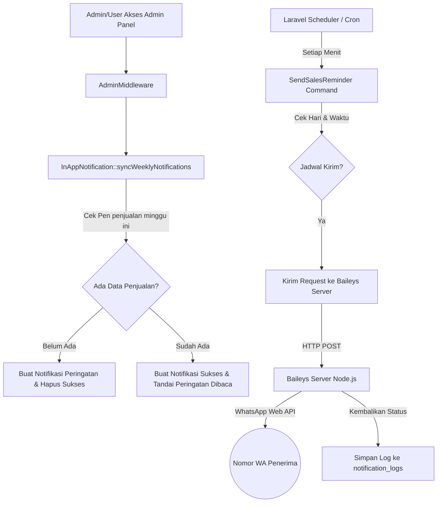

# Dokumentasi Teknis: Sistem Notifikasi & Integrasi WhatsApp Dapur Ovaltin

Dokumen ini menjelaskan seluruh perubahan, fitur baru, dan struktur sistem notifikasi (baik otomatis via WhatsApp maupun notifikasi in-app) yang telah diimplementasikan pada aplikasi **Dapur Ovaltin**. Dokumentasi ini dirancang agar anggota tim pengembang lainnya dapat memahami cara kerja dan cara pemeliharaan sistem ini.

---

## 1. Arsitektur Umum & Alur Notifikasi

Sistem notifikasi memiliki dua jenis saluran (channels):
1. **WhatsApp Gateway (External)**: Mengirimkan pengingat otomatis ke nomor WhatsApp admin menggunakan server Baileys mandiri (self-hosted).
2. **In-App Notifications (Internal)**: Menampilkan widget lonceng notifikasi dan halaman riwayat di dashboard admin berdasarkan status penginputan data penjualan minggu berjalan.



---

## 2. Fitur & Komponen yang Diubah/Dibuat

### A. WhatsApp Gateway Mandiri (Self-hosted Baileys)
Migrasi dari layanan pihak ketiga berbayar (Fonnte) ke server Node.js lokal gratis menggunakan library `@whiskeysockets/baileys`.

- **Lokasi Kode Server**: Folder [baileys-server](file:///d:/ABdimas/ovaltin/baileys-server) di root project.
  - `package.json`: Menggunakan dependency `@whiskeysockets/baileys` versi `7.0.0-rc13` (stabil untuk sinkronisasi WA Business) dan `express`.
  - `index.js`: Menyediakan REST API endpoint `POST /send-message` pada port `3000`. Menyimpan session autentikasi WhatsApp secara aman di folder `auth_info_baileys`.
- **Integrasi Laravel**:
  - Konfigurasi URL server WA di `.env` (`WHATSAPP_SERVER_URL=http://127.0.0.1:3000`) dan dideklarasikan di `config/services.php`.
  - Diatur dalam file service [WhatsAppService.php](file:///d:/ABdimas/ovaltin/app/Services/WhatsAppService.php).

### B. Pengaturan Jadwal Hari Pengiriman WA Secara Dinamis
Admin kini dapat memilih hari pengiriman notifikasi pengingat secara fleksibel di dashboard admin melalui pilihan checkbox.

- **Database**: Menambahkan kolom `target_days` (tipe JSON/Array) pada tabel `notification_settings`.
- **Artisan Command**: File [SendSalesReminder.php](file:///d:/ABdimas/ovaltin/app/Console/Commands/SendSalesReminder.php) membaca data hari aktif dari database sebelum mengirim pesan.
- **Tampilan Form**: Ditambahkan checkbox pilihan hari Senin s.d. Minggu di halaman [Pengaturan Notifikasi](file:///d:/ABdimas/ovaltin/resources/views/admin/notification-settings/index.blade.php).

### C. Log Riwayat Pengiriman WhatsApp (WhatsApp Logs)
Memantau pengiriman pesan WhatsApp otomatis maupun tes pengiriman langsung dari dashboard admin.

- **Database**: Membuat tabel `notification_logs` (migrasi `2026_06_18_000001_create_notification_logs_table.php`).
- **Pencatatan**: Setiap pengiriman pesan WA dicatat secara otomatis (penerima, jenis pesan, isi pesan, status sukses/gagal, dan pesan error jika gagal).
- **Tampilan**: Ditampilkan di bagian bawah menu pengaturan notifikasi berupa tabel riwayat log 15 pengiriman terakhir dengan status badge berwarna.

### D. Fitur Lonceng & Riwayat Notifikasi In-App (Fitur Baru)
Fitur internal untuk mengingatkan admin secara visual ketika membuka aplikasi.

- **Database**: Membuat tabel `in_app_notifications` (migrasi `2026_06_18_000002_create_in_app_notifications_table.php`).
- **Model**: [InAppNotification.php](file:///d:/ABdimas/ovaltin/app/Models/InAppNotification.php) dengan logika sinkronisasi `syncWeeklyNotifications()`:
  - Notifikasi **Peringatan**: *"Anda belum memasukkan data pada minggu ini silahkan melakukan input data"* (tipe: `warning`).
  - Notifikasi **Sukses**: *"Selamat anda sudah melakukan input data"* (tipe: `success`).
- **Middleware**: Memodifikasi [AdminMiddleware.php](file:///d:/ABdimas/ovaltin/app/Http/Middleware/AdminMiddleware.php) agar menjalankan fungsi sinkronisasi di atas secara otomatis pada setiap request halaman admin.
- **Rute Baru** ([web.php](file:///d:/ABdimas/ovaltin/routes/web.php)):
  - `/admin/notifications` (Riwayat lengkap notifikasi).
  - `/admin/notifications/{id}/read` (Menandai dibaca lalu redirect otomatis ke halaman penjualan `/sales-data`).
  - `/admin/notifications/mark-all-read` (Menandai semua notifikasi telah dibaca).
- **Controller**: [NotificationController.php](file:///d:/ABdimas/ovaltin/app/Http/Controllers/NotificationController.php).
- **Layout Bell Icon**: Lonceng notifikasi dipasang di navigasi utama [app.blade.php](file:///d:/ABdimas/ovaltin/resources/views/layouts/app.blade.php) menggunakan Alpine.js untuk menampilkan 5 notifikasi terbaru beserta unread counter badge.
- **Halaman Riwayat**: Halaman khusus di [index.blade.php](file:///d:/ABdimas/ovaltin/resources/views/admin/notifications/index.blade.php) untuk melacak log notifikasi in-app lama dengan paginasi.

---

## 3. Panduan Pemeliharaan & Troubleshooting bagi Tim Pengembang

### Langkah Awal untuk Menjalankan Project Secara Lokal
Ketika developer baru menarik (pull) project ini, berikut langkah-langkah menjalankannya:

1. **Jalankan Migrasi Database**:
   ```bash
   php artisan migrate
   ```
2. **Setup Server WhatsApp (Baileys)**:
   - Masuk ke folder server:
     ```bash
     cd baileys-server
     ```
   - Instal dependensi Node.js:
     ```bash
     npm install
     ```
   - Jalankan server Baileys:
     ```bash
     node index.js
     ```
   - **PENTING**: Saat pertama kali dijalankan, scan **QR Code** yang muncul di terminal menggunakan aplikasi WhatsApp di handphone (melalui menu Perangkat Tertaut/Linked Devices) untuk menghubungkan akun pengirim.

3. **Jalankan Laravel Scheduler & Server**:
   - Terminal 1: `php artisan serve`
   - Terminal 2: `php artisan schedule:work` (untuk menjalankan pengingat otomatis di server lokal).

---

### FAQ & Troubleshooting untuk Developer

* **Tanya: Mengapa notifikasi WhatsApp tidak terkirim?**
  * **Jawab**: 
    1. Pastikan server Baileys (`node index.js`) dalam kondisi hidup dan terhubung (status *Connected*).
    2. Pastikan nomor penerima sudah menyimpan nomor pengirim, dan pastikan penerima sudah pernah mengirim pesan terlebih dahulu ke bot untuk membangun relasi kepercayaan (*trust relationship*) di WhatsApp.
    3. Pastikan konfigurasi `.env` pada Laravel memiliki `WHATSAPP_SERVER_URL` yang mengarah ke alamat port server Baileys yang benar (default: `http://127.0.0.1:3000`).

* **Tanya: Kapan notifikasi peringatan in-app "Belum input data" dibuat?**
  * **Jawab**: Setiap kali admin mengakses halaman dashboard admin atau halaman penjualan, middleware akan mendeteksi apakah di database telah ada data penjualan untuk minggu berjalan (Senin - Minggu). Jika belum ada dan notifikasi peringatan belum dibuat untuk minggu tersebut, sistem akan otomatis membuatnya di tabel `in_app_notifications`.

* **Tanya: Bagaimana cara menguji pengiriman WhatsApp tanpa menunggu jadwal?**
  * **Jawab**: Admin dapat membuka menu **Pengaturan Notifikasi** di web panel admin, lalu mengklik tombol **"Kirim Test Sekarang"** di bagian bawah konfigurasi. Log pengiriman akan langsung tercatat di tabel log riwayat di bawahnya.
